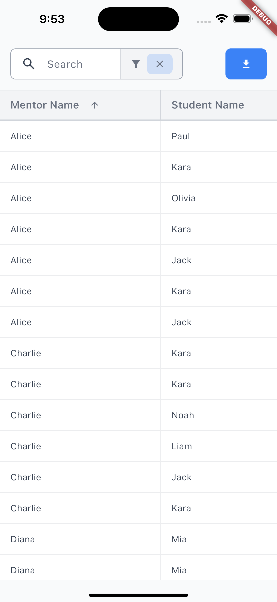

# mentor_data_table

**mentor_data_table** is a Flutter application that displays mentor session records in a searchable, filterable, and sortable table, with the ability to export data to XLSX.

## Screenshots

_Table Screen_

<p align="left">
  
  
</p>

_Filter Menu_

<p align="left">
  
  
</p>

## Running the App

1. **Clone the repository**

    ```bash
    git clone https://github.com/your-username/mentor_data_table.git
    cd mentor_data_table
    ```

2. **Fetch dependencies**

    ```bash
    flutter pub get
    ```

3. **Run the app**
    - **Web**:
        ```bash
        flutter run -d chrome
        ```
    - **Desktop (Windows/macOS/Linux)**:
        ```bash
        flutter run -d windows   # or -d macos, -d linux
        ```

## App Walkthrough

1. **Search**

    - The search bar uses a 300ms debounce to delay filtering until the user pauses typing.

2. **Sorting**

    - Click any column header to toggle its sort state: none → ascending → descending → none.
    - Supports multi-level sorting: clicking additional headers adds secondary (and tertiary) sort criteria, enabling sorting by multiple columns.

3. **Advanced Filters**

    - Tap the filter icon to open the advanced filter menu.
    - Add, edit, or delete filter rows; filters are only applied when **Apply Filters** is clicked.
    - While in the filter menu, use the delete button on each row to remove individual filters.
    - After applying filters, a filter badge appears; click its clear icon to remove all filters at once.

4. **Export to XLSX**
    - Press the **Download** button to export the current table view (including active search, filters, and sorts) to an `.xlsx` file.
    - On desktop/mobile, the app will attempt to open the exported file with the default application.
    - On web, the file is downloaded via the browser's download mechanism.

## Code Walkthrough

Below is a high-level overview of the main modules and how they fit together:

### Entry Point

-   **`lib/main.dart`**  
    Configures debugging, wraps the app in a Riverpod `ProviderScope`, and applies the `shadcnTheme`. Launches `TableScreen` as the home widget.

### Data Layer

-   **`lib/data/repositories/mentor_session/mentor_session_repository_local.dart`**  
    Provides a local JSON-based `MentorSession` repository via a Riverpod provider.
-   **`lib/data/services/export_xls/export_xls_service.dart`**  
    Builds an Excel workbook from session data and delegates to platform-specific exporters (`platform_export.dart`).

### Domain Models

-   **`lib/domain/models/mentor_session/mentor_session.dart`**  
    Defines the immutable `MentorSession` data class with JSON serialization.
-   **`lib/domain/models/mentor_session/mentor_session_extension.dart`**  
    Adds indexed access (`operator[]`) to `MentorSession` via the `Field` enum.
-   **`lib/domain/models/filter/filter.dart`** & **`filter_extension.dart`**  
    Represents filtering criteria and converts `Filter` instances into `Specification<MentorSession>`.
-   **`lib/domain/models/sort/sort.dart`**  
    Defines sorting criteria (`Sort`) and directions.
-   **`lib/utils/specification.dart`**  
    Implements the Specification pattern with combinators (`and`, `or`) for building reusable predicates.

### UI Layer

-   **Core Utilities**
    -   `lib/ui/core/breakpoints.dart`: Responsive breakpoint definitions and context extensions.
    -   `lib/ui/core/themes/shadcn_theme.dart`: Custom Material theme for the app.
-   **State & Logic**
    -   `lib/ui/mentor_table/view_models/table_state/table_state.dart`: Immutable UI state for the mentor table.
    -   `lib/ui/mentor_table/view_models/table_viewmodel.dart`: `AsyncNotifier<TableState>` handling load, search, filter, sort, and export actions.
-   **Widgets**

    -   `lib/ui/mentor_table/widgets/search_filter_bar.dart`: Debounced search bar and filter toggle.
    -   `lib/ui/mentor_table/widgets/filter_menu.dart`: Advanced filter form overlay.
    -   `lib/ui/mentor_table/widgets/mentor_session_table.dart`: Scrollable table with sortable headers.

    -   `lib/ui/mentor_table/widgets/table_screen.dart`: Overall screen scaffold combining search bar, table, and filter overlay.

## License & Author

**Author:** Dusti Johnson
